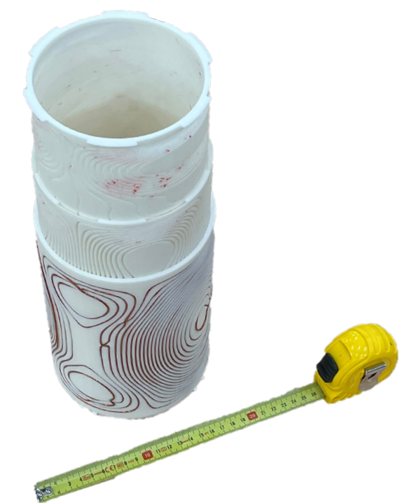

# Gradient Coils

## Table of Contents 📑

- [Gradient Coils](#gradient-coils)
  - [Table of Contents 📑](#table-of-contents-)
  - [Description 📜](#description-)
  - [Project Structure 📂](#project-structure-)
  - [Summary 📝](#summary-)
    - [Coil Design and Manufacturing 🛠️:](#coil-design-and-manufacturing-️)
    - [Validation of Design ✅:](#validation-of-design-)
  - [Hardware Requirements 💻](#hardware-requirements-)
  - [Software Requirements 🛠️](#software-requirements-️)
  - [Authors and Acknowledgment 🙌](#authors-and-acknowledgment-)
  - [License 📜](#license-)
  - [DISCLAIMER ⚠️](#disclaimer-️)

## Description 📜

This project contains the design, manufacturing, and testing documentation for gradient coils used in a low-field MRI project, similar to the OSII² project.



## Project Structure 📂

```bash
GradientCoils/
├── CoilDesign/              # Gradient coil design files
│   ├── Prototype/           # Design files for mini prototype coil
│   ├── Print/               # Contains Fusion360 file and STL files for printing final coils
│   └── src/                 # Source code for coil design
│
├── HallProbe/               # Magnetic field measurement tools
│   ├── HallProbeDriver/     # Arduino code for TMAG5273 sensor control
│   └── HallProbeMonitor/    # Data visualization application
│
├── MeasurementAssignment/   # Files for the reproducibility assignment
│
├── Presentation_Poster/     # Files for presentation and poster
│
├── project_canvas_TitouanSiyuanAndrej.md  # Project documentation and progress
└── README_GradientCoils.md  # Main readme file
```

## Summary 📝

### Coil Design and Manufacturing 🛠️:

The gradient coils were designed with CoilGen/PyCoilGen. This software calculates the wire path for linear gradients and given coil parameters. The output of this software (STL files containing the wirepath) was used to design coil holders in Fusion360. Three holders, one for each gradient were designed. The holders were 3D printed out of PLA with PETG as support material on a PrusaXL. Finally the 1.25 mm thick copper wire was inserted into the coil holders. For more detail about the coil design look in the [CoilDesign](CoilDesign/) folder.

### Validation of Design ✅:

In order to validate the produced gradient of the manufactured coil a 3D hall probe [TMAG5273](https://www.ti.com/lit/ds/symlink/tmag5273.pdf) was used. The gradient in the coil was measured upon connection of a current source, while the hall probe was inserted and moved by hand in the coil. For more information about the measurement and the hall probe look in the [HallProbe](HallProbe/) folder.

## Hardware Requirements 💻

- Computer with 16GB RAM (for coil design)
- Prusa XL 3D printer (or comparable)
- 1.25mm coated copper wire
- TMAG5273D2 Hall probe sensor
- Arduino or compatible microcontroller (For HallProbe)

## Software Requirements 🛠️

- MATLAB or Python with PyCoilGen
- Autodesk Fusion 360
- Arduino IDE

## Authors and Acknowledgment 🙌

Siyuan, Andrej, Titouan\*, as part of the Low field legends under the supervision of Sanli.

## License 📜

This is an open source hardware project licensed under the CERN Open Hardware License Version 2 - Weakly Reciprocal. For more information, please check [LICENSE](LICENSE) and [DISCLAIMER](DISCLAIMER.pdf).

## DISCLAIMER ⚠️

Parts of the documentation and code were enhanced by Github copilot.
